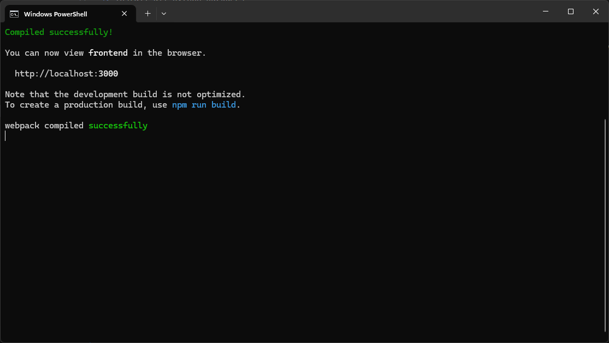
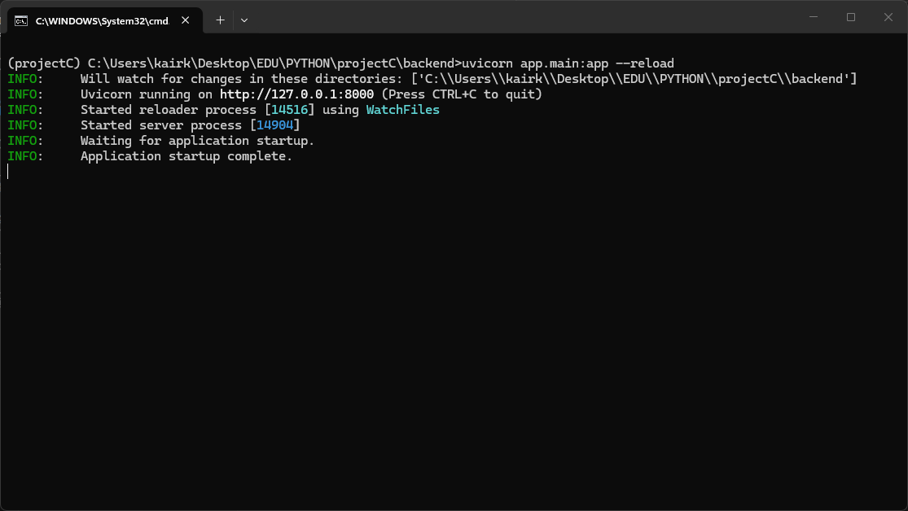

# projectC

## Description
A website me and [@Ohello404](https://github.com/Ohello404) developed as a Advanced Python Programming course's final project in AITU (Kazakhstan).
It is a marketplace for selling antiques, souveniers or relics. 

## Installation
The only thing you need to get installed on your Windows is [Docker Desktop](https://docs.docker.com/desktop/setup/install/windows-install/).

After the installation open **Docker Desktop** and login, if you already have an account, or create one.

Next up you will need to clone this repo:
```bash
git clone https://github.com/Kinshikinai/projectC.git
```

## To run locally
You will need to have install these guys:
- **Node.js**
- **Python 3.14.x**
- **pgAdmin 4**
Then you need to:
1. Go to folder `frontend`
```bash
cd frontend
```
2. Install all node modules on your machine
```bash
npm i
```
3. Go to folder `backend`
```bash
cd ../backend
```
4. Install all python packages
```bash
pip install -r requirements.txt
```
*Note:* if you don't want to install these packages on your machine directly, you can do it in python venv
```bash
python -m venv projectCvenv
C:/Users/yourusername/path-to-git-repo/backend/projectCvenv/Scripts/activate.bat
```
5. Starting frontend:
```bash
cd frontend
npm start
```
It should show something like:


6. Before starting backend, we need to setup our database:
- Setup pgAdmin4 server
- Open pgAdmin4
- Create your own user or continue with `postgres`
- Go to only `server` you have -> `databases`.
- Left-click and choose `Create` -> `Database` (Alt + Shift + N)
- Name it `porjectC` or any other name
- Left-click on database you just created and choose `Restore`c
- In `Format` choose `Plain`
- Select the file located in `backend/app/projectCdb.sql`
- Click `Restore` (choose your user in role, if you created one other than `postgres`)

7. Edit files in `backend/app`:
- Open the `backend/app/db.py` file
- Set `host` to `localhost`
- Set `database` to `projectC` or the name you set for database
- Set `user` to `postgres` or the name os user you created
- Set `password` to password you set while pgAdmin4 setup
- Let the port remain the same

8. Starting backend:
```bash
cd backend
uvicorn app.main:app --reload
```


## To run using Docker
*No installations to local machine needed*

1. Go to repository and run:
```bash
docker compose up --build
```

2. Copy backup file to docker machine:
```bash
docker cp "C:\Users\your-username\path-to-repo\backend\app\projectCdb.sql" postgres_db:/tmp/projectCdb.sql
```

3. Apply backup to postgres container:
```bash
docker exec -i postgres_db psql -U yourusername -d projectC -f /tmp/projectCdb.sql
```

4. Go to [frontend](http://localhost:3000)